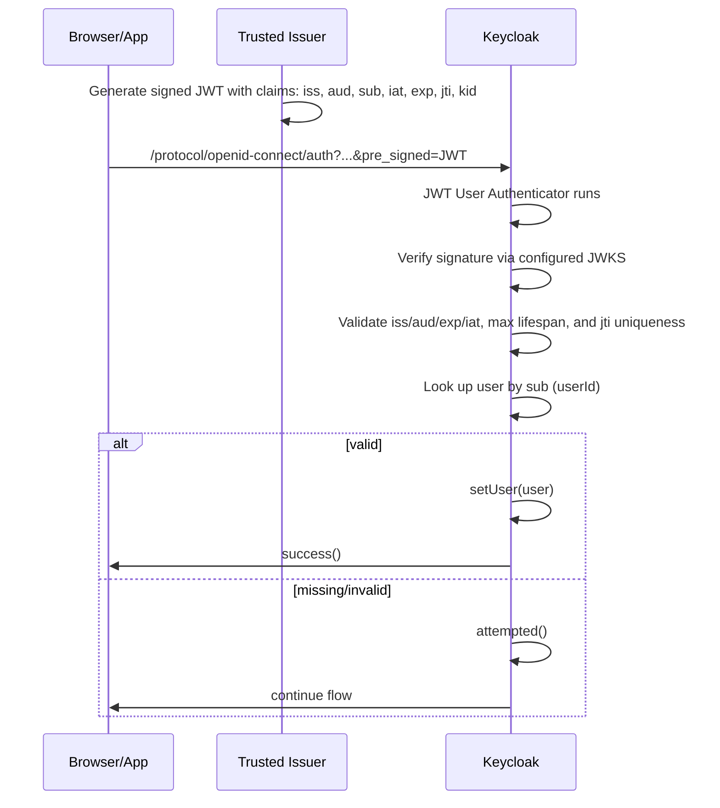

# Keycloak JWT User Authenticator

Delegate user authentication to trusted external systems using signed JSON Web Tokens (JWTs) in links.

This extension provides two Keycloak authenticator providers:

- **JWT User Authenticator**: Validates signed JWTs in the URL parameters of the authorization endpoint for non-interactive authentication.
- **URL Parameter Condition**: Conditional authenticator for flow control based on query parameters, necessary for setting up step-up authentication flows.

## Use cases

- **Cross-platform hand-off**: Authenticate users moving between web and native apps. Web sessions can generate JWTs for app deep links after download. Apps can generate JWTs when opening web views or external browsers for settings, billing, or content.

- **Sales funnel continuation**: Send authenticated links to complete interrupted flows like abandoned carts, trial conversions, or onboarding steps without requiring users to log in again.

- **Event reminder notifications**: Deliver authenticated access via email, SMS, or messaging apps for appointments, meetings, webinars, or renewals. Users click and authenticate in one step.

- **Embedded content access**: Apps generate JWTs to open authenticated web content in embedded or external browsers, such as documentation, articles, or account management pages.

- **Recurring reports**: Send periodic authenticated links to dashboards, statements, invoices, or logs. Users access reports directly without manual login.

## How it works

The authenticator looks for a signed JWT in a configured query parameter when executed. When the token is valid, the authenticator selects the user and completes authentication. When the token is missing or invalid, the authenticator returns `attempted` and allows the authentication flow to continue.

**Authentication behavior:**

- No token: Returns `attempted` (flow continues)
- Valid, signed token: Returns `success` and authenticates the user
- Invalid, expired, or used token: Returns `attempted` (flow continues)

**Token validation:**

- Signature: Verified against a static JSON Web Key Set (JWKS) (supports RSA, ECDSA P-256/P-384/P-521, and Ed25519)
- `iss`: Must equal the configured Trusted Issuer ID
- `aud`: Must contain the realm issuer URL `https://<keycloak-host>/realms/<realm>`
- `exp`: Must be in the future
- `iat` and `exp`: Lifespan must satisfy `0 ≤ (exp − iat) ≤ Max Token Lifespan`
- `sub`: Must be a valid Keycloak user ID (looked up by ID, not username)
- `jti`: Must be present and unique (replay attempts are rejected)



## Requirements

- Keycloak 26.x (tested with 26.3.4)
- Java 21

## Supported signature algorithms

The authenticator supports the following JWT signature algorithms:

- **RSA**: RS256, RS384, RS512
- **ECDSA**: ES256 (P-256), ES384 (P-384), ES512 (P-521)
- **EdDSA**: Ed25519

## Install

1. Download the JAR from the [releases page](https://github.com/stefanmaric/keycloak-jwt-user-authenticator/releases/) or [build it](#build-the-provider) yourself.
2. Copy it to your Keycloak `providers/` directory.
3. Restart Keycloak.
4. Confirm the installation by verifying that both providers appear in the Admin Console at the **Provider info** tab of the master realm as `jwt-user-authenticator` and `conditional-url-parameter` authenticators.

## Create keys and a JWKS

The authenticator requires an asymmetric key pair. The public key is wrapped in a JSON Web Key Set (JWKS) and set in the authenticator configuration while the private key is kept secure on the issuer side.

### Generate keys with Node.js

```js
// Generate an Ed25519 key and export a JWKS with a random kid
import { generateKeyPair, exportJWK } from "jose";
import { randomUUID } from "node:crypto";

const { publicKey, privateKey } = await generateKeyPair("EdDSA");
const publicJwk = await exportJWK(publicKey);
// Required by the authenticator and not set by `jose`:
publicJwk.kid = randomUUID();
publicJwk.use = "sig";
// Print a JWKS (JSON Web Key Set) containing the public key
console.log(JSON.stringify({ keys: [publicJwk] }, null, 2));
// Save the printed JWKS into "Trusted JWKS (JSON)"
// Keep the private key on the issuer side and protect it.
```

### Generate keys with Java

```java
// Create an RSA key and print a JWKS (public part) with kid
import com.nimbusds.jose.jwk.RSAKey;
import com.nimbusds.jose.jwk.gen.RSAKeyGenerator;
import com.nimbusds.jose.jwk.JWKSet;

RSAKey rsa = new RSAKeyGenerator(2048).keyID(java.util.UUID.randomUUID().toString()).generate();
String jwks = new JWKSet(rsa.toPublicJWK()).toString();
// Print a JWKS (JSON Web Key Set) containing the public key
System.out.println(jwks);
// Save the printed JWKS into "Trusted JWKS (JSON)"
// Keep the private key on the issuer side and protect it.
```

**Important**: Each key in the JWKS must have a `kid` (key ID) and `use: "sig"` (signature use).

## Configure

This setup uses conditional flows and Level of Assurance (LoA) to properly scope JWT authentication as a lower-assurance method. This is the recommended production configuration.

1. In the Admin Console, go to **Authentication → Flows** (for example, the Browser flow).
2. Create a new sub-flow at the top level and set it to **ALTERNATIVE**, alongside other alternative executions such as Cookie, Kerberos, or Identity Provider Redirector.
3. Create a new sub-flow for each of the authenticators and LoAs required and set them all to **CONDITIONAL**.
4. Inside the first sub-flow, add **Condition - URL Parameter** as the first execution:
   - Set the requirement to **REQUIRED**
   - Configure the URL parameter name (for example, `pre_signed` or `jwt_hint`)
   - Leave the expected value empty, so it checks for presence only
5. Add **Condition - Level of Authentication** as the second execution:
   - Set the requirement to **REQUIRED**
   - Set the Level of Assurance to `1` (lowest level)
6. Add **JWT User** as the third execution in the sub-flow:
   - Set the requirement to **REQUIRED**
   - Configure the execution settings:
     - **Alias**: A unique name for this execution configuration
     - **Trusted Issuer ID**: Value expected in the `iss` claim (required)
     - **Trusted JWKS (JSON)**: A static JSON Web Key Set; each key must have a `kid` (required)
     - **JWT query parameter name**: Must match the URL parameter name from step 4
     - **Max token lifespan (seconds)**: Maximum allowed `exp − iat` (default: `10800` = 3 hours)
     - **Authenticator Reference (AMR)**: Set to `jwt-link` or similar (recommended)
     - **Max Age**: Leave empty or set appropriately for your use case
7. Add your other authenticators (for example, Password or WebAuthn) in separate conditional sub-flows with higher LoA levels (for example, `2` for Password, `3` for WebAuthn).

This configuration ensures JWT authentication only runs when the URL parameter is present, and marks it as a low-assurance method that may require step-up for sensitive operations.

See the [Keycloak step-up authentication documentation](https://www.keycloak.org/docs/latest/server_admin/index.html#_step-up-flow) for more details on LoA and Authentication Methods References (AMR).

### Simple setup

For testing or specific use cases where step-up authentication is not needed, add **JWT User** directly to your flow as an **ALTERNATIVE** execution. This provides no assurance level distinction and treats JWT authentication the same as password-based methods. This approach is simpler but less secure for production environments.

## Issue tokens

Sign tokens with a private key whose public component is in the configured JWKS and has a matching `kid`.

**Required claims:**

- `iss`: Must equal the configured Trusted Issuer ID
- `aud`: Must contain `https://<keycloak-host>/realms/<realm>`
  - Use the realm issuer URL as shown in the realm’s OpenID Provider Configuration (OIDC discovery) document (`issuer` field)
- `sub`: Must be the Keycloak user ID
- `iat` and `exp`: Must satisfy `0 ≤ (exp − iat) ≤ Max Token Lifespan`
- `jti`: Must be present and unique for each token

### Sign tokens with Node.js

```js
import { SignJWT, importJWK } from "jose";
import { randomUUID } from "node:crypto";

// Load your issuer's private JWK (matching an entry in the configured JWKS)
const privateJwk = /* load from your key store */;
const key = await importJWK(privateJwk, "EdDSA");
const kid = privateJwk.kid; // use the kid from the key itself

const now = Math.floor(Date.now() / 1000);
const token = await new SignJWT({})
      .setProtectedHeader({ alg: "EdDSA", kid })
      .setIssuer("com.example.email-service")
      .setAudience("https://keycloak.example.com/realms/myrealm")
      .setSubject("c8bff1d8-9c9a-4b1a-8c9f-9f2c233e1b00") // Keycloak user ID
      .setIssuedAt(now)
      .setExpirationTime(now + 300) // 5 minutes
      .setJti(randomUUID())
      .sign(key);

console.log(token);
```

### Sign tokens with Java

```java
import com.nimbusds.jose.JWSAlgorithm;
import com.nimbusds.jose.JWSHeader;
import com.nimbusds.jose.crypto.Ed25519Signer;
import com.nimbusds.jose.jwk.OctetKeyPair;
import com.nimbusds.jwt.JWTClaimsSet;
import com.nimbusds.jwt.SignedJWT;

OctetKeyPair okp = OctetKeyPair.parse(/* load your private JWK from your key store */);
JWSHeader header = new JWSHeader.Builder(JWSAlgorithm.EdDSA)
  .keyID(okp.getKeyID())
  .build();
JWTClaimsSet claims = new JWTClaimsSet.Builder()
  .issuer("com.example.email-service")
  .audience("https://keycloak.example.com/realms/myrealm")
  .subject("c8bff1d8-9c9a-4b1a-8c9f-9f2c233e1b00")
  .issueTime(new java.util.Date())
  .expirationTime(new java.util.Date(System.currentTimeMillis() + 300_000))
  .jwtID(java.util.UUID.randomUUID().toString()) // jti
  .build();
SignedJWT jwt = new SignedJWT(header, claims);
jwt.sign(new Ed25519Signer(okp));
String token = jwt.serialize();

```

## Use the token in an authentication request

Add the signed token to the configured query parameter when starting the OpenID Connect (OIDC) authorization request.

**Example with a parameter named `pre_signed`:**

```
https://keycloak.example.com/realms/myrealm/protocol/openid-connect/auth?
   client_id=my-client&
   response_type=code&
   redirect_uri=https%3A%2F%2Fapp.example.com%2Fcallback&
   scope=openid+profile&
   pre_signed=eyJhbGciOiJFZERTQSIsImtpZCI6ImVkMjU1MTktMjAyNS0wMS0wMSJ9....
```

When the token is valid and its configured LoA is sufficient for the given authorization request, the user is authenticated and redirected to the client. If the token is missing or invalid, the authenticator returns `attempted` and the flow continues to other authenticators (for example, password).

## Troubleshooting

Common error messages and solutions:

- **missing kid header** → Include a `kid` in the token header and the JWKS
- **issuer mismatch** → `iss` does not match the configured Trusted Issuer ID
- **audience mismatch** → `aud` must contain `https://<keycloak-host>/realms/<realm>`
- **lifespan exceeds max** → Reduce `exp − iat` or raise Max Token Lifespan
- **user not found** → `sub` must be a valid Keycloak user ID in the realm
- **missing jti** → Include a `jti` claim
- **replay detected** → Use a unique `jti`; do not reuse tokens

## Security model

### Signed JWT only

The authenticator uses the `sub` claim (Keycloak user ID) to select the user. Signature verification ensures authenticity and integrity; confidentiality is not required for `sub`. No other personal data is needed in the token, so JSON Web Encryption (JWE) support is omitted by design.

### Backchannels and assurance level

Magic links sent over email or SMS are convenient but provide weak security:

- Mailboxes can be compromised
- Email providers may inspect user data
- SMS is vulnerable to SIM swap and forwarding attacks

Treat JWT authentication as a lower Level of Assurance (LoA). Use Authentication Context Class Reference (ACR) and LoA policies and flows to require step-up authentication (passwords, Time-based One-Time Password (TOTP), Web Authentication (WebAuthn)) for sensitive actions.

See the [Keycloak step-up authentication documentation](https://www.keycloak.org/docs/latest/server_admin/#_step-up-flow) for more details.

### Replay and token lifetime

**One-time use:** The `jti` claim is required and stored to prevent reuse. Repeated `jti` values are rejected. Entries are removed after expiration to keep storage bounded.

**Token validity:** Both `iat` and `exp` claims are required. Tokens must be currently valid (`now < exp`) and have a limited lifespan (`0 ≤ exp − iat ≤ Max Token Lifespan`). Lifespans exceeding 3 days will generate a warning in the logs.

### Key management and rotation

**Key rotation**: Use JSON Web Key Sets (JWKS) to rotate keys by adding new keys and removing old ones. The authenticator picks the key by `kid` in the token header.

**Multiple issuers**: Use different JWKS for different issuers or purposes. You can configure multiple JWT User executions in a flow, each with its own JWKS and Trusted Issuer ID.

**Best practices:**

- Rotate keys regularly
- Keep both old and new keys in JWKS during transition periods
- Monitor server logs for signature verification failures after rotation
- Use strong key sizes: RSA 2048+, ECDSA P-256+, or Ed25519
- Store private keys securely using a Hardware Security Module (HSM), key vault, or encrypted storage

### Performance and caching

- The JWKS JSON is parsed and cached in memory by content (hash-based). Updating the authenticator configuration with a new JWKS value refreshes the cache.
- Only public keys are used; signature verification relies on the Nimbus JOSE + JWT library.

### Limitations

- Static JWKS only: fetching a remote JWKS URL is not supported.
- `sub` must be a Keycloak user ID; usernames or emails are not accepted.
- The token is read from a URL query parameter on the authorization endpoint; request headers or POST bodies are not read. This might be added in future versions.

## Development

### Build requirements

- JDK 21
- Gradle (wrapper included)

### Build the provider

Build the provider JAR with shaded dependencies:

```shell
./gradlew shadowJar
```

The artifact is produced at:

```
build/libs/keycloak-jwt-user-authenticator-<version>.jar
```

Copy this file to your Keycloak `providers/` directory and restart Keycloak.

## License

[MIT](./LICENSE) ♥
